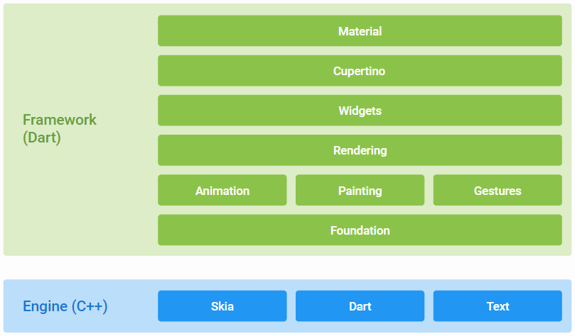
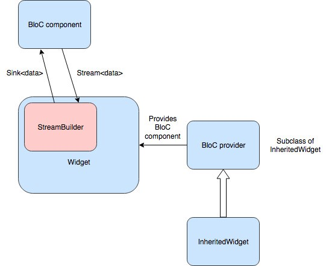
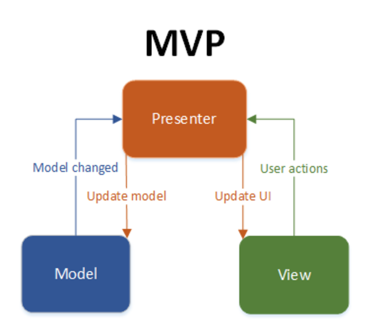

# case-study-xiangl18
case-study-xiangl18 created by GitHub Classroom  
# Case Study: flutter
# Technology and Platform used for development 
a.	What coding languages are used? Do you think the same languages would be used if the project was started today? What languages would you use for the project if starting it today?  
The code language used in flutter is dart, I think the same language would be used if the project is started today, for it is a language for Declarative Programming, and it is strongly typed comparing to JavaScript, and the price for making new object is very low, also it can be compiled with AOT JIT, so it is faster when running. And also it is simpler than Java.  

b.	What build system is used (e.g. Bazel, CMake, Meson)? What build tools / environment are needed to build (e.g. does it require Visual Studio or just GCC or ?)    
The build tool is gradle.  
  
c.	What frameworks / libraries are used in the project? At least one of these projects don’t use any external libraries or explicit threading, yet is noted for being the fastest in its category--in that case, what intrinsic language techniques is it using to get this speed.  
The framework for flutter is:
  * Dart platform
  * Flutter engine
  * Foundation library
  *	Design-specific widgets  
 
# Testing: describe unit/integration/module tests and the test framework  
a.	How are they ensuring the testing is meaningful? Do they have code coverage metrics for example?  
They use coveralls for their code coverage metrics.  
b.	What CI platform(s) are they using (e.g. Travis-CI, AppVeyor)?  
They use Cirrus CI as their CI platform.  
c.	What computing platform combinations are tested on their CI? E.g. Windows 10, Cygwin, Linux, Mac, GCC, Clang  
The platforms tested are Windows, Linux, Mac.  
# Software architecture in your own words, including:  
a.	How would you add / edit functionality if you wanted to? How would one use this project from external projects, or is it only usable as a standalone program?  
Firstly, you should set up the framework, which need the following dependencies:
*	Linux, Mac OS X, or Windows.
*	git (used for source version control).
*	An IDE. Android Studio with the Flutter plugin is our flagship IDE. You can use whatever IDE you feel most comfortable with.
*	An ssh client (used to authenticate with GitHub).
*	Python (used by some of our tools).
*	The Android platform tools.(which can be installed by: Mac: brew cask install android-platform-tools
Linux: sudo apt-get install android-tools-adb)  

Then fork https://github.com/flutter/flutter into your own github, and fetch it to your local repo.
After that you should read [Style guide for Flutter repo](https://github.com/flutter/flutter/wiki/Style-guide-for-Flutter-repo) to understand the preferred style for code written as part of the Flutter project. For this part, you should follow philosophy of the code format, and also, documentation which is necessary to explain your code.  
Also you should write your own test for your new features, and check the code coverage on Coveralls to make sure that every line is tested.  
b.	What parts of the software are asynchronous (if any)?  
When using the flutter, you can use library in dart to program asynchronously in case there is a program block. For example, we can use the future object or use await and async to implement asynchrony.  
c.	Please make diagrams as appropriate for your explanation  

  

d.	How are separation of concerns and information hiding handled?  
e.	What architectural patterns are used    
For flutter, there are mainly two architectural patterns: BloC and MVP.  

For the BloC:  

  
The idea behind it is to have separated components (BloC components) containing only the business logic that is meant to be easily shared between different Dart apps.  

For the MVP:  

  

* The model is an interface defining the data to be displayed or otherwise acted upon in the user interface.
* The view is a passive interface that displays data (the model) and routes user commands (events) to the presenter to act upon that data.
* The presenter acts upon the model and the view. It retrieves data from repositories (the model), and formats it for display in the view.  

f.	Does the project lean more towards object oriented or functional components  
The project is object oriented.  
# Analyze two defects in the project--e.g. open GitHub issue, support request tickets or feature request for the project
a. Does the issue require an architecture change, or is it just adding a new function or?  
b. make a patch / pull request for the project to fix problem / add feature  
# Reference  
Wikipedia:  
[Model–view–presenter](https://en.wikipedia.org/wiki/Model%E2%80%93view%E2%80%93presenter)  
BloC:  
[BloC Architecture in Flutter](https://medium.com/@artemsidorenko/bloc-architecture-in-flutter-a-modern-architectural-approach-and-how-we-use-it-at-jimdo-bea143b56d01)  
flutter:  
[contribute to flutter](https://github.com/flutter/flutter/blob/master/CONTRIBUTING.md)

